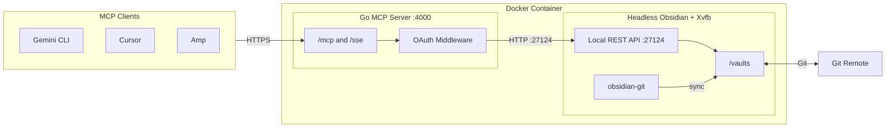

# Obsidian Remote

A high-performance MCP server for your Obsidian vault, written in Go. This server acts as a bridge between MCP clients and the Obsidian [Local REST API](https://github.com/coddingtonbear/obsidian-local-rest-api).

## Features

- **Headless & Fast:** Runs Obsidian headlessly with all vault operations via the Local REST API.
- **RFC 9728 Compliant:** Implements OAuth-protected resource discovery.
- **Dual Transport:** Supports both Streamable HTTP and SSE transports.
- **Secure:** Integrated JWT and OAuth access token validation with email-based access control.
- **Server-Side Token Proxy:** Clients never need the OAuth client secret — the server injects it during the token exchange.
- **Google OAuth:** JWT validation via JWKS with opaque access token fallback via Google's tokeninfo endpoint.

## Prerequisites

- Docker and Docker Compose.
- A public URL (HTTPS) if accessing from outside your local network.
- A Google OAuth client ID and secret. In Google Cloud Console, create an OAuth client with the **Desktop app** type — this allows `http://localhost` redirect URIs on any port, which is required by MCP clients like Gemini CLI and Cursor. Other OIDC providers are supported for JWT validation only.

## Resource Requirements

The container runs headless Obsidian (Electron/Chromium) with Xvfb alongside the Go MCP server. Chromium is the dominant memory consumer.

| Resource | Minimum | Recommended |
| :------- | :------ | :---------- |
| RAM      | 1 GB    | 2 GB        |
| CPU      | 1 vCPU  | 1 vCPU      |
| Disk     | 3 GB    | 5 GB+       |

Disk usage includes the Docker image (~2 GB base) plus vault storage. Typical runtime memory sits around 300–500 MB depending on vault size.

## Setup

1. **Configure Environment:**

   ```bash
   cp .env.example .env
   ```

   Edit `.env` with your configuration:

   **Server:**
   - `PUBLIC_HOST`: The external URL of this server (e.g., `https://obsidian.yourdomain.com`).

   **OAuth:**
   - `OAUTH_ISSUER`: Your OIDC issuer (e.g., `https://accounts.google.com`).
   - `OAUTH_JWKS_URL`: The URL to fetch public signing keys (e.g., `https://www.googleapis.com/oauth2/v3/certs`).
   - `OAUTH_AUTHORIZE_URL`: The provider's authorization endpoint (e.g., `https://accounts.google.com/o/oauth2/v2/auth`).
   - `OAUTH_TOKEN_URL`: The provider's token endpoint (e.g., `https://oauth2.googleapis.com/token`).
   - `OAUTH_AUDIENCE`: Your OAuth Client ID.
   - `OAUTH_CLIENT_SECRET`: Your OAuth Client Secret (used server-side for the token exchange proxy).
   - `OAUTH_ALLOWED_EMAIL`: The specific email address authorized to access the vault.

   **Vault Sync (optional):**
   - `GIT_REPO_URL`: Git repository URL for vault sync (e.g., `git@github.com:user/vault.git`).
   - `GITHUB_PAT`: GitHub personal access token for private repos.
   - `VAULT_PATH`: Path to the vault inside the container (default: `/vaults`).

2. **Run with Docker:**
   ```bash
   docker compose up -d --build
   ```

## Client Configuration

### Gemini CLI

Add to your `~/.config/gemini/settings.json` (or `.gemini/settings.json` in the project):

```json
{
  "mcpServers": {
    "obsidian-remote": {
      "httpUrl": "https://obsidian.yourdomain.com/mcp",
      "oauth": {
        "clientId": "your-client-id.apps.googleusercontent.com",
        "scopes": ["openid", "email", "profile"]
      }
    }
  }
}
```

Then authenticate:

```
/mcp auth obsidian-remote
```

The server handles OAuth discovery automatically via `/.well-known/oauth-protected-resource` and proxies the token exchange so clients never need the client secret.

### Other Clients (SSE)

Clients that support the SSE transport can connect to `/sse` instead:

```json
{
  "mcpServers": {
    "obsidian-remote": {
      "url": "https://obsidian.yourdomain.com/sse"
    }
  }
}
```

## Endpoints

| Path                                      | Method          | Description                                  |
| :---------------------------------------- | :-------------- | :------------------------------------------- |
| `/mcp`                                    | POST/GET/DELETE | Streamable HTTP transport (recommended)      |
| `/sse`                                    | GET             | SSE transport                                |
| `/message`                                | POST            | SSE message endpoint                         |
| `/authorize`                              | GET             | OAuth authorize proxy (injects scope)        |
| `/token`                                  | POST            | Token exchange proxy (injects client secret) |
| `/config`                                 | GET             | Dynamic client config (issuer + client ID)   |
| `/.well-known/oauth-protected-resource`   | GET             | RFC 9728 resource metadata                   |
| `/.well-known/oauth-authorization-server` | GET             | RFC 8414 authorization server metadata       |
| `/.well-known/mcp`                        | GET             | MCP-specific resource discovery              |
| `/register`                               | POST            | Dynamic client registration (RFC 7591)       |

## Available Tools

- `list_notes`: List all notes in the vault.
- `read_note`: Read the content of a specific note.
- `update_note`: Create or update a note.
- `append_note`: Append content to the end of an existing note.
- `delete_note`: Permanently delete a note.
- `global_search`: Search for text or regex across the vault.
- `search_replace`: Targeted search and replace within a specific file.
- `manage_frontmatter`: Manage YAML frontmatter keys.
- `manage_tags`: Add or remove tags from a note.

Write operations (`update`, `append`, `delete`, `search_replace`, `manage_frontmatter`, `manage_tags`) are annotated as destructive, prompting clients to request user confirmation before execution.

## Architecture



The Docker container bundles Obsidian (headless), the [Local REST API](https://github.com/coddingtonbear/obsidian-local-rest-api) plugin (auto-trusted on first boot), and the Go MCP server. The MCP server supports both Streamable HTTP (`/mcp`) and SSE (`/sse`) transports, converting MCP tool calls into HTTP requests for the internal Obsidian REST API. Authentication is handled via OAuth 2.0 with support for both JWT (ID tokens) and opaque access tokens validated against Google's tokeninfo endpoint.
